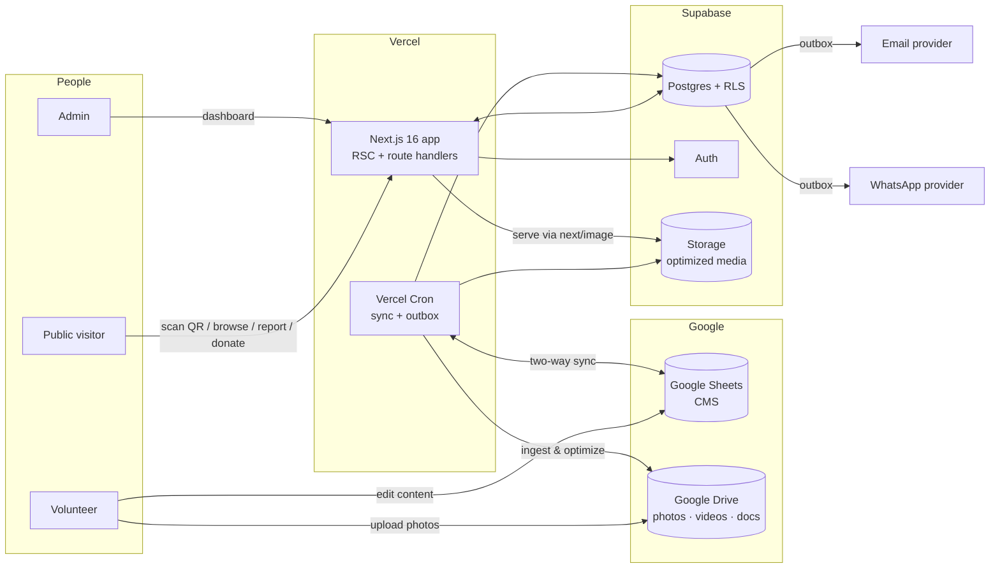
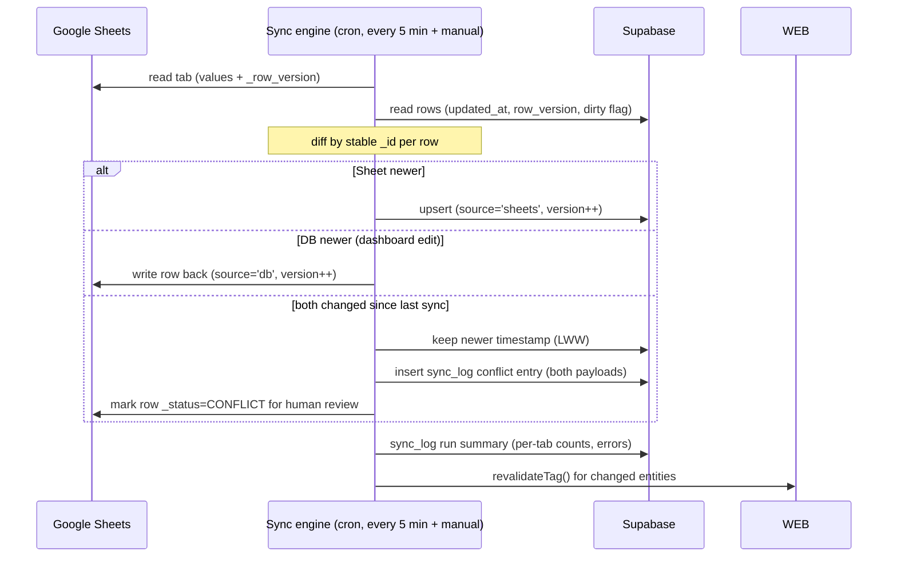

# KGP PAWS — System Architecture

Living document. Last updated **2026-07-16**. Companion specs:
[DATABASE_SCHEMA.md](DATABASE_SCHEMA.md) · [GOOGLE_SHEETS_SCHEMA.md](GOOGLE_SHEETS_SCHEMA.md) ·
[API_SPEC.md](API_SPEC.md) · [DEPLOYMENT.md](DEPLOYMENT.md)

---

## 1. System context



Two content workflows, both first-class:

```
Volunteer → Google Sheets → Sync engine → Supabase → Website
Admin     → Dashboard     → Supabase    → Sync engine → Google Sheets
```

## 2. Repository inventory (current state)

The repo is a working, deployed Next.js 16 application (~100 source files), built 2026-07-12→16.
**Rule: improve, don't rewrite.** Working code is preserved; refactors are scoped per module.

```
app/                    Route tree (App Router, RSC-first)
  page.tsx              Homepage (11 sections)
  animal/[slug]/        Animal profile (flagship)      → gains /dog/[publicId] alias in M4
  p/[token]/route.ts    QR token resolver (redirect)
  adopt/ …apply/[slug]  Adoption discovery + 6-step application
  donate/               Campaigns + transparency        → UPI rework in M5
  stories/ …[slug]      Editorial stories               → Sheets-driven in M7
  report/ …[id]         Report form + public tracker
  map/                  Stylized campus map (zone privacy)
  login/ signup/        Supabase auth + demo fallback
  dashboard/ …volunteer AuthN user/volunteer dashboards
  admin/ (6 pages)      Operations: overview, animals, reports, adoptions, donations, stories
  sitemap.ts robots.ts  SEO
components/             ui kit · home sections · animals · qr · map · report · donate · admin …
services/               Data access seam: Supabase when configured, demo data otherwise
lib/config.ts           Env detection (single source of truth for "is X configured")
lib/demo/               Labelled fictional dataset (kept as dev/preview fixture)
lib/supabase/           Browser + server clients (null in demo mode)
lib/local-store.ts      Demo-mode localStorage persistence
supabase/migrations/    0001 full schema (23 tables, enums, RLS, audit triggers)
types/                  Domain types mirroring SQL schema
docs/                   ← this documentation suite
```

**Key existing seam:** every page reads through `services/*`, which checks
`isSupabaseConfigured` and falls back to demo data. New backends (Sheets-sync'd Supabase) plug
in behind this seam without touching pages.

## 3. Frontend

- **Framework:** Next.js 16 (App Router, Turbopack, TypeScript strict). Server Components by
  default; client components only where interaction requires (forms, filters, motion, dashboards).
- **Styling:** Tailwind CSS v4 with design tokens in `app/globals.css` — palette (forest
  `#173F35`, cream `#F7F1E7`, terracotta `#C96745`, sand `#DCC9A3`, charcoal `#202421`),
  Fraunces (display) + Manrope (UI) via `next/font`.
- **Motion stack (policy):**
  | Layer | Tool | Use |
  |---|---|---|
  | Micro-interactions, presence | **Framer Motion** (installed) | buttons, cards, staggered reveals |
  | Scroll choreography & pinning | **GSAP + ScrollTrigger** (M3+) | photo storytelling, parallax walls |
  | Smooth scrolling | **Lenis** (M3+) | site-wide, disabled for `prefers-reduced-motion` |
  | 3D moments | **Three.js / R3F** (M4+, P2) | photo-textured hero moment only; no cartoon 3D |
  Every effect ships with a reduced-motion + no-JS fallback. Heavy libs load behind
  `next/dynamic` and never block LCP.
- **Imagery policy:** real photographs only (Drive-sourced). The current parameterized SVG
  portrait system (`components/animals/Portrait.tsx`) is retired from public pages in M3 and
  kept solely as an internal fallback for records that have no photo yet.

## 4. Backend

No separate server. Backend = **Next.js route handlers + server actions on Vercel** talking to
Supabase, plus **Vercel Cron** for scheduled jobs. Privileged operations (sync, notifications,
QR issuance) use the Supabase **service-role key, server-side only**.

- `app/api/sync/*` — Sheets⇄Supabase sync engine (cron + manual trigger, secret-guarded)
- `app/api/media/ingest` — Drive → Storage ingestion (cron)
- `app/api/reports` / `app/api/donations/confirm` — public writes (validated, rate-limited)
- `app/api/qr/*` — QR create/reissue + A4 PDF sheet generation
- `app/api/search` — intelligent search endpoint
- `app/api/notify/dispatch` — outbox drainer (cron)

Full contracts in [API_SPEC.md](API_SPEC.md).

## 5. Database (Supabase Postgres)

Authoritative store for everything the website renders. 23-table schema already written
(`supabase/migrations/0001_initial_schema.sql`): animals + medical events + sightings + photos,
qr_tags + qr_scans, rescue_reports + report_updates, donation_campaigns + donations +
campaign_expenses, adoption_applications, stories + story_media, volunteers + assignments,
user_roles, impact_metrics, notifications, audit_logs. **Row Level Security on every table**;
precise report coordinates and internal notes never pass a public policy; donation totals come
only from verified rows. Migration `0002` (M1–M5) adds sync metadata, `DOG#####` public IDs,
`donation_confirmations` (UTR model), `sync_log`, `notification_outbox`, `drive_assets`,
`site_settings`. Details: [DATABASE_SCHEMA.md](DATABASE_SCHEMA.md).

## 6. Google Sheets CMS & two-way sync

**Why Sheets:** volunteers already live in spreadsheets; zero training, zero code. One
spreadsheet (**"KGP PAWS CMS"**) with one tab per entity — full column specs in
[GOOGLE_SHEETS_SCHEMA.md](GOOGLE_SHEETS_SCHEMA.md).

**Sync engine (M2):**



Design rules:
- Every row owns a **stable `_id`** (generated on first sync; protected column). Row position
  never matters; volunteers can sort/filter freely.
- **System columns** (`_id`, `_row_version`, `_synced_at`, `_status`) are protected ranges —
  visible, not editable.
- **Validation before write:** invalid rows are skipped, marked `_status=ERROR: <reason>` in
  the sheet, and logged — a bad row never poisons a sync run.
- **Deletes are soft:** volunteers set `Active=FALSE`; the engine never hard-deletes from either side.
- Auth: Google **service account** (Sheets + Drive scopes); the spreadsheet is shared to the
  service-account email as Editor. Credentials live in a server-only env var.
- Every applied change also writes `audit_logs` (actor = `sheets-sync`).

> **Implementation status (2026-07-17):** the diagram above is the target design. What's
> actually built is the top-left path only — `POST /api/sync/run`
> (`app/api/sync/run/route.ts`) reads the Dogs tab and upserts into `animals`, diffing by
> `sheet_row_id`, writing generated `_id`/`public_id` back to the sheet, and logging to
> `sync_log`. **Not yet built:** the DB→Sheets write-back path, conflict detection (`alt` branch
> above), `revalidateTag()` cache invalidation, and the cron schedule itself. None of it has run
> against a real spreadsheet — there's no Google Cloud service account to test with yet (see
> KNOWN_ISSUES.md #2). Treat the code as carefully reasoned-through, not proven.

## 7. Google Drive image & media pipeline

Serving straight from Drive is slow and rate-limited, so Drive is the **upload inbox**, not the CDN:

```
Volunteer drops photo in Drive folder (e.g. /Dogs/DOG00001/gallery/2.jpg)
  → ingest cron lists changed files (Drive API, changes feed)
  → download → sharp: strip EXIF-GPS, resize ladder (3200/1600/800/400), AVIF/WebP + blurhash
  → upload to Supabase Storage (public bucket, immutable cache headers)
  → upsert drive_assets row {drive_id, dog_id, kind, sizes, blurhash, checksum}
  → link into animal_photos / story_media by folder convention (auto-discovery)
  → revalidate affected pages
```

**Folder convention (authoritative — matches the spec exactly):**

```
Dogs/
  DOG00001/
    cover.jpg            → the dog's cover image (exactly one)
    gallery/             → unlimited profile photos
      1.jpg  2.jpg  …
    medical/             → unlimited treatment photos + documents
      report.pdf  treatment.jpg  …
Blogs/<slug>/            → blog images
Videos/                  → shared video assets
```

Media is **auto-discovered** from this structure — no spreadsheet row needed per image
(hence no `Gallery` tab in GOOGLE_SHEETS_SCHEMA.md). `cover.jpg` is the cover; `gallery/*` is
the public gallery in filename order; `medical/*` attaches to the dog's medical records and
inherits their visibility rules (PDFs and treatment photos are **not** automatically public —
they render only where the medical record itself is public).

**Fallback:** a dog with no `cover.jpg` yet falls back to the existing illustrated portrait
component rather than a broken image (`fallback_images: true` in the spec).
- Frontend always renders via `next/image` → responsive, lazy, cached. Videos: poster + lazy
  `<video>` (or YouTube embed if URL provided).
- Local nicety: the owner's Drive is mounted at `G:\My Drive\…`, so bulk seeding can run
  locally before API credentials exist.

> **Implementation status (2026-07-17):** `POST /api/media/ingest`
> (`app/api/media/ingest/route.ts`) implements the Drive→Storage path above — folder
> traversal, checksum-based change detection, `sharp` optimization, `drive_assets` +
> `animal_photos` upsert. **Not yet built:** the AVIF/WebP responsive ladder (currently one
> JPEG per photo, not 3200/1600/800/400 variants) and blurhash. **Never live-tested** — no
> Drive API credentials exist yet. What *has* actually run, using the local-mount nicety noted
> above rather than the Drive API: a one-time manual import script (not part of the app) that
> optimized and uploaded 10 real photos from `G:\My Drive\By Shubham\Dog photo\` directly to
> Supabase Storage, seeding the first real animal (`dreamland`) and story (`field-notes-2025`).
> See CHANGELOG.md 2026-07-17.

## 8. Authentication & authorization

- Supabase Auth (email/password). Two product roles: **volunteer**, **admin** (stored in
  `user_roles`, granted by admin).
- **Authorization is enforced in Postgres RLS**, not the UI. `RequireRole` client guard is UX
  only. Service-role key never ships to the client.
- Demo mode (no env vars) keeps the instant role-explorer for local dev/preview.

## 9. QR pipeline

- Public URL on printed tags: **`https://kgppaws.org/dog/DOG00023`** (human-readable permanent
  ID, per spec). `/p/{token}` stays as the revocable fallback and legacy redirect.
- Generate (admin): allocate `DOG#####` if new → render QR (error-correction **H** for outdoor
  wear) → store PNG in Storage + `qr_tags` row → optionally batch into **A4 PDF sheet**
  (react-pdf: 2×4 tags/page with name + ID + logo, crop marks).
- Scan: `/dog/DOG00023` → profile with scan greeting, gallery, medical history, vaccination,
  sterilization, treatment timeline, Donate, Emergency contact, Report buttons.

## 10. Donations (UPI, gateway-free)

Admin uploads UPI QR image(s) + UPI ID + account-holder name via Settings sheet → Donate page
displays them with "scan with any UPI app" instructions. After paying, donor optionally submits
the **confirmation form** (name, email?, phone?, amount, UTR, purpose, message) →
`donation_confirmations` (Supabase) → sync → Donations sheet → outbox → Email + WhatsApp to
admin → admin sets `Approved` → donor appears on the public thank-you wall. **No gateway; no
payment success is ever claimed by the site** — the UTR record is explicitly "reported by donor,
verified by admin".

## 11. Notification pipeline

Transactional writes (report, donation confirmation, adoption application) insert into
`notification_outbox` in the same transaction. A cron drainer sends via:
- **Email:** Resend (recommended; simple API, generous free tier) — or Gmail SMTP app-password.
- **WhatsApp:** Meta WhatsApp Cloud API (recommended; free service tier) — or Twilio. Final
  choice is an owner decision (see checklist).
Retries with backoff; delivery status recorded per message; failures surface on the dashboard.

## 12. AI semantic search (M8)

Spec calls for **semantic** search ("understands intent, not just keywords"), which means
embeddings, not just lexical matching:

```
content (dogs, blogs, pages, FAQ, medical history, volunteers, adoption)
  → chunk + embed (embedding provider — see decision below)
  → store vector in search_index (pgvector extension on Supabase)
query → embed → cosine similarity (ivfflat index)
      → hybrid re-rank with Postgres FTS (tsvector) + pg_trgm for exact/typo matches
      → RLS filters role-gated rows (medical detail) by the caller's context
```

Hybrid (vector + lexical) rather than pure vector: exact lookups like a dog's name or
`DOG00001` must rank first deterministically, which embeddings alone do poorly.

**Open decision — embedding provider.** Options: OpenAI `text-embedding-3-small` (cheap,
excellent quality, external API + cost), or a local/open model via Supabase Edge Functions
(free, lower quality, more setup). This is the one place the spec implies an AI service that
isn't in `required_connectors` — flagged in KNOWN_ISSUES #21, needs an owner decision before M8.

## 12b. Realtime

`real_time: true` — Supabase Realtime channels subscribe the admin dashboard to `postgres_changes`
on `rescue_reports`, `donation_confirmations`, and `sync_log`, so new reports/donations and sync
results appear without a refresh. Public pages stay static/ISR (no realtime cost on the hot path).

## 12c. PWA

`app/manifest.ts` (Next-native) + a hand-rolled service worker at `public/sw.js` registered
client-side. No `next-pwa` dependency — it is not maintained against Next.js 16, and the
requirement is small enough to own directly.

- **Strategy:** network-first for pages (content freshness matters for medical info),
  cache-first with a versioned cache for static assets/images, and a precached offline
  fallback page.
- **Why it matters here:** campus signal is unreliable; a volunteer scanning a collar QR near
  the far halls should still see a previously-viewed dog's profile and the emergency contact.
- **Safety:** the SW never caches `/admin`, `/dashboard`, or any authenticated response.

## 13. Deployment & environments

Vercel (production: kgp-paws.vercel.app → kgppaws.org when DNS ready) + Supabase (managed
Postgres/Auth/Storage) + Vercel Cron (sync every 5 min, media ingest 15 min, outbox 1 min).
Caching: static/ISR pages with `revalidateTag` invalidation from the sync engine; images
immutable on CDN. Full runbook: [DEPLOYMENT.md](DEPLOYMENT.md).

## 14. Cross-cutting quality

- **Performance:** Lighthouse 100×4 target — RSC-first, zero client JS on content pages beyond
  islands, image ladder + blurhash, font subsetting, no layout shift (M10 audit).
- **Privacy:** no precise-location publishing; EXIF-GPS stripped on ingest; donor/reporter
  contacts never public; scan analytics aggregate-only.
- **Auditability:** `audit_logs` trigger on sensitive tables + sync_log for every sync run.
- **Accessibility:** WCAG-AA, reduced-motion variants for every animation, keyboard-first dialogs.
