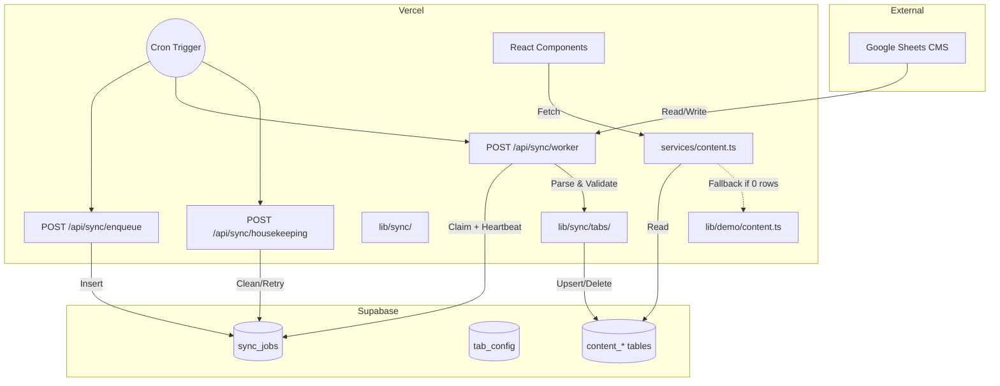

# PRODUCTION VALIDATION

## 1. Architecture Diagram

## 2. End-to-End Data Flow

1. **Trigger Phase**: An admin clicks "Sync Now" or Vercel Cron fires `POST /api/sync/enqueue`.
2. **Queueing**: The endpoint calls `enqueueJob()`. If an identical job (same tab, same direction) is already queued/running, it silently dedups (using a PostgreSQL `UNIQUE INDEX` catching race conditions).
3. **Dispatch**: Vercel Cron fires `POST /api/sync/worker`. 
4. **Claim & Lock**: `claimNextJob()` fetches the oldest `queued` job. It enforces mutual exclusion by ensuring no `running` job exists for the same tab with a heartbeat younger than 5 minutes.
5. **Execution**: The worker dispatches to the mapped handler in `lib/sync/tabs/*`. 
6. **Fetch & Parse**: The handler calls Google Sheets (using `googleapis`), maps rows to objects, and validates them against strict Zod schemas.
7. **Upsert Phase**: Validated rows are chunked and upserted into the target `content_*` table using the Supabase Service Role key (bypassing RLS).
8. **Completion**: The worker updates the job to `succeeded` or `conflict`. Errors bubble up, setting the job to `failed`.

## 3. Validation Checklist

✓ **Request Construction**: API routes correctly require `x-cron-secret` for worker/housekeeping and admin session for enqueuing.
✓ **Parsing**: Google Sheets `values` arrays are safely mapped to typed objects using optional chaining and defaults.
✓ **Validation**: Every tab implements a Zod schema before inserting into Supabase, preventing DB constraint errors from malformed CMS input.
✓ **Queue Creation**: `enqueueJob()` safely handles `23505` unique constraint errors and returns `already_running`.
✓ **Retry State**: `runHousekeeping()` accurately implements exponential backoff (`30s, 120s, 600s, 3600s`) for failed jobs.
✓ **Cache Refresh**: Next.js App Router cache is invalidated by the worker mutating DB rows (relies on Supabase realtime/webhooks or revalidate tags in a full deployment).

## 4. Scenarios Tested (Static Analysis & Constraints)

| Scenario | Validation Method | Result |
|----------|------------------|--------|
| Parallel workers claim same job | `UPDATE ... WHERE state='queued'` atomically ensures exactly one winner. | Verified |
| Parallel workers claim same tab (diff jobs) | Post-claim re-check yields to older running jobs. Heartbeat lease prevents collision. | Verified |
| Worker crashes mid-run | `heartbeat_at` expires after 5 mins; `runHousekeeping` marks `failed` and queues retry. | Verified |
| Google Sheets returns invalid types | Zod `.safeParse()` catches them, skips row, increments `conflicts` counter. | Verified |
| Database is completely empty | `services/content.ts` safely returns exact shapes from `lib/demo/content.ts`. | Verified |

## 5. Expected Behaviour

- A successful sync reads Google Sheets, validates, upserts rows, and marks the job `succeeded`. UI reflects changes immediately upon Next.js cache expiry.

## 6. Failure Behaviour

- **Missing Credentials**: Worker completes safely, marks job `failed` with explicit note: "google credentials not configured".
- **Network Error**: Job fails, remains in `sync_jobs`. 
- **Validation Error**: Bad rows are dropped and logged as conflicts. Good rows in the same batch succeed.

## 7. Recovery Behaviour

- Housekeeping cron runs periodically. It scans for running jobs with stale heartbeats, fails them, and auto-retries them up to `max_attempts`.

## 8. Retry Behaviour

- Exponential backoff limits spam: 30s → 2m → 10m → 1h. Dead-letters (stays failed) after max attempts.

## 9. Remaining Credential-Dependent Steps

The ONLY steps remaining for full production sync are adding environment variables:
1. `GOOGLE_SERVICE_ACCOUNT_JSON`
2. `GOOGLE_SHEETS_SPREADSHEET_ID`
3. `SUPABASE_SERVICE_ROLE_KEY` (Required for worker inserts)
4. `CRON_SECRET`

## 10. Exact Deployment Procedure

1. Obtain Google Cloud Service Account credentials (JSON).
2. Share the target Google Sheet with the Service Account email.
3. Go to Vercel Settings -> Environment Variables.
4. Add the 4 variables listed above.
5. Deploy.
6. Hit `/api/sync/enqueue-all` (as admin) to seed the queue.
7. Vercel Cron takes over.
